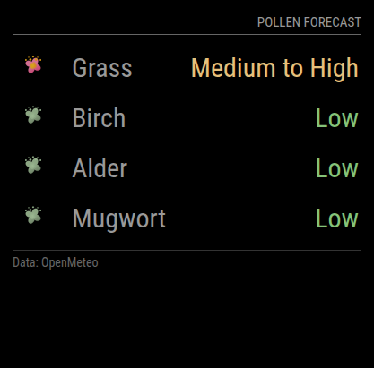

# MMM-AirQuality-OpenMeteo

## Overview

MMM-AirQuality-OpenMeteo is a MagicMirror² module designed to display pollen forecasts. It fetches data from the **Open-Meteo.com** and provides an intuitive view of pollen levels across various types.
This module is based on a Swedish module developped here: https://github.com/cgillinger/MMM-PollenSwe



## Features

- Displays pollen levels for different regions using longitude and latitude.
- Includes icons to visually represent pollen levels.

## Installation

1. Clone the repository into your MagicMirror modules folder:
   ```bash
   cd ~/MagicMirror/modules
   git clone https://github.com/thony974/MMM-AirQuality-OpenMeteo.git
   ```
2. Navigate into the module directory and install dependencies:
   ```bash
   cd MMM-AirQuality-OpenMeteo
   npm install
   ```

## Configuration

Add the following configuration block to the `config.js` file of your MagicMirror installation:

```js
{
  module: "MMM-AirQuality-OpenMeteo",
  position: "top_right",
  config: {
    pollenTypes: ["grass_pollen", "birch_pollen"],
    latitude: 48.7269,
    longitude: 2.283,
    updateInterval: 3600000,
    showIcon: true,
    showValue: false
  }
}
```

Note:

- pollenTypes: Choose pollen type name regarding OpenMeteo API variable names,
- showValue: Show detailed value for pollen levels (grains/m3)

## Usage

- The module fetches the latest data from the API and displays it in a table format.
- Use the `testMode` option for testing the module with predefined data.

## Credits

- **API**: Data provided by [Open-Meteo.com](https://open-meteo.com/en/docs/air-quality-api).
- **Icons**: Weather icons from [Meteocons Weather Icons](https://iconduck.com/sets/meteocons-weather-icons), licensed under [MIT License](https://opensource.org/licenses/MIT).

## License

This module is licensed under the [MIT License](https://opensource.org/licenses/MIT).

---

**For issues or contributions**, visit the [GitHub repository](https://github.com/thony974/MMM-AirQuality-OpenMeteo).
